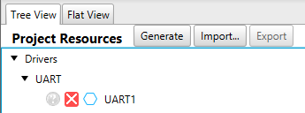
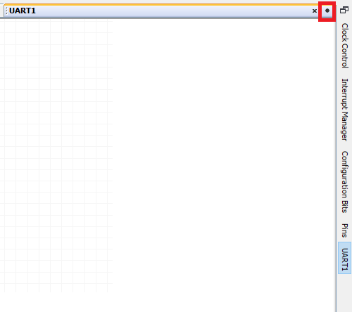
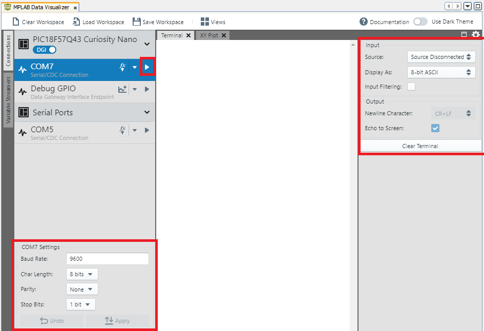
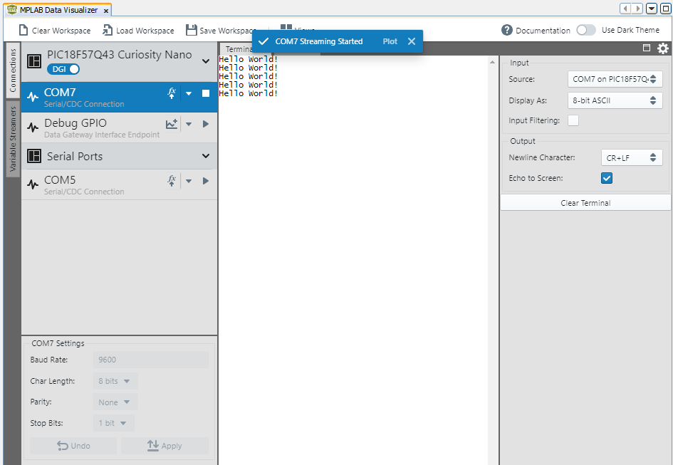

<!-- Please do not change this logo with link -->
[](https://www.microchip.com)

# Hello World over UART

This example shows how to configure UART in MPLAB Code Configurator (MCC). The example uses the Pin Manager to configure the pin and generate an API with which the pin is later interfaced. Also, the MPLAB Data Visualizer is used to show the output from the UART communication.

## Related Documentation

- [MPLAB Code Configurator](https://www.microchip.com/en-us/development-tools-tools-and-software/embedded-software-center/mplab-code-configurator)
- [PIC18F57Q47 Data Sheet](https://ww1.microchip.com/downloads/en/DeviceDoc/PIC18F27-47-57Q43-Data-Sheet-DS40002147E.pdf)
- [PIC18F57Q47 Family Product Page](https://www.microchip.com/wwwproducts/en/PIC18F57Q43)

## Software Used

- [MPLAB® X IDE](http://www.microchip.com/mplab/mplab-x-ide) **5.45** or newer
- [MPLAB® XC8](http://www.microchip.com/mplab/compilers) **2.31** or a newer compiler 
- [MPLAB® Code Configurator (MCC)](https://www.microchip.com/mplab/mplab-code-configurator) **4.1.0** or newer 
- [MPLAB® Melody Library](https://www.microchip.com/en-us/development-tools-tools-and-software/embedded-software-center/mplab-code-configurator) **1.37.25** or newer
- [Microchip PIC18F-Q Series Device Support pack](https://packs.download.microchip.com/) **1.9.175** or newer Device Pack
- [MPLAB Data Visualizer Plugin](https://www.microchip.com/en-us/development-tools-tools-and-software/embedded-software-center/mplab-data-visualizer?utm_source=GitHub&utm_medium=TextLink&utm_campaign=MCU8_MMTCha_PIC18FQ43&utm_content=pic18q43_v_to_f_github)

## Hardware Used
- [Microchip PIC18F47Q57 Curiosity Nano Evaluation Kit](https://www.microchip.com/Developmenttools/ProductDetails/DM164150)

## Setup
MCC with Melody library was used to implement this example as shown in the following sections.

### UART Driver
The UART Driver was simply added to the project by locating it in the Device Resources pane on the left side in MCC. Within the Drivers menu (expand if needed, red box in image below)UART menu (expand if needed, green box in image below), click on the green plus next to where it says UART1 (blue box in image below)

*Device Resources*


When the UART Driver was added, it was shown in the Project Resources and in the Builder view as seen below.

*Project Resources - UART1*



*Builder*


If you click the '+' button at the top of the System Firmware box, it will expand to show what is in the above image.  From here, clicking the 'Pins' box will open the Pins Grid View.  To utilize that view, see the "Pin Configuration" section below.

### UART Configuration
The UART needs to be configured properly in order to have the code work properly.  There are a few possibilities of what you will see on your screen.  Feel free to skip ahead to the image that matches what you see on your screen.

There should be a tab on the right side that says "UART1", click it (red box, see image below).

*UART1 tab is vertical on the right*


Next click on the little black solid circle in the upper right of the screen (red box, see image below).

*UART1 tab is selected, menu is behind builder tab*




Now, the correct settings are selected in the configuration window.  The **Enable UART** switch is toggled on.  The **Baud Rate** is set to 9600.  The **Enable Transmit** switch is toggled on.  In the **Advanced Settings** section, the **Baud Rate Generator Speed Select** is set to high speed.  The changes are highlighted by the red boxes (see image below).

*UART1 Configuration tab*


### Pin Configuration
The Pin controlling the UART on the Curiosity Nano board was configured using the Pins Grid View.  The Pins Grid View is accessed by clicking on the Pins line in Project Resources.

*Project Resources - Pins*


Then the pin connected to the RX pin, RC7, was selected as an output by clicking the corresponding padlock symbol (red box, see image below) and the TX pin, RC6, was selected as an input by clicking the corresponding symbol (green box, see image below).

*Pins Grid View*


### Circuit Implementation
The RX was connected to pin RC6 on the Curiosity Nano.  The exact connect is shown in the image below by the green line.

*Curiosity Nano UART Circuit*


### Code Implementation
Click Generate within the Project Resources Menu.

*Generate the code*


There are a few pieces of code that need to be added to the main.c program. 

First, the code needs to include the string.h library. Include it by using the following command (second line below).
```c
#include "mcc_generated_files/system/system.h"
#include <string.h>
```
Second, include the following function that uses the UART1 API and will used later.

```c
void UART1_sendString(const char *str)
{
    while(*str)
    {
        while (!(UART1_IsTxReady()));
        UART1_Write(*str++);
    }
}
```
Lastly, the function that was just created will send "Hello World" every 1000ms (1 second) to the MPLAB Data Visualizer by using the following code.  

```c
int main(void)
{
    SYSTEM_Initialize();

    while (1)
    {
        UART1_sendString("Hello World!\r\n");
        __delay_ms(1000);
    }
}
```

## Operation

After having flashed the application to the PIC18F57Q47 Curiosity Nano, the result will still not be visible.

In order to see the "Hello World" that was programmed earlier. The settings for the COM port (bottom left, see image below), the settings for the Terminal (upper right, see image below), and the button (the 'play' symbol) next to the COM port the Curiosity Nano is connected to (COM7, in image below) need to be properly configured.The following image shows the terminal when it is off.

*Data Visualizer - COM Port off*



The image below is what the Data Visualizer should look like when the button next to the COM port is clicked (shows the stop logo).

*Data Visualizer - COM Port On*



## Summary

The example has shown how MCC and the MPLAB Data Visualizer can be used to configure and verify that UART works on the PIC18F57Q47 device.
